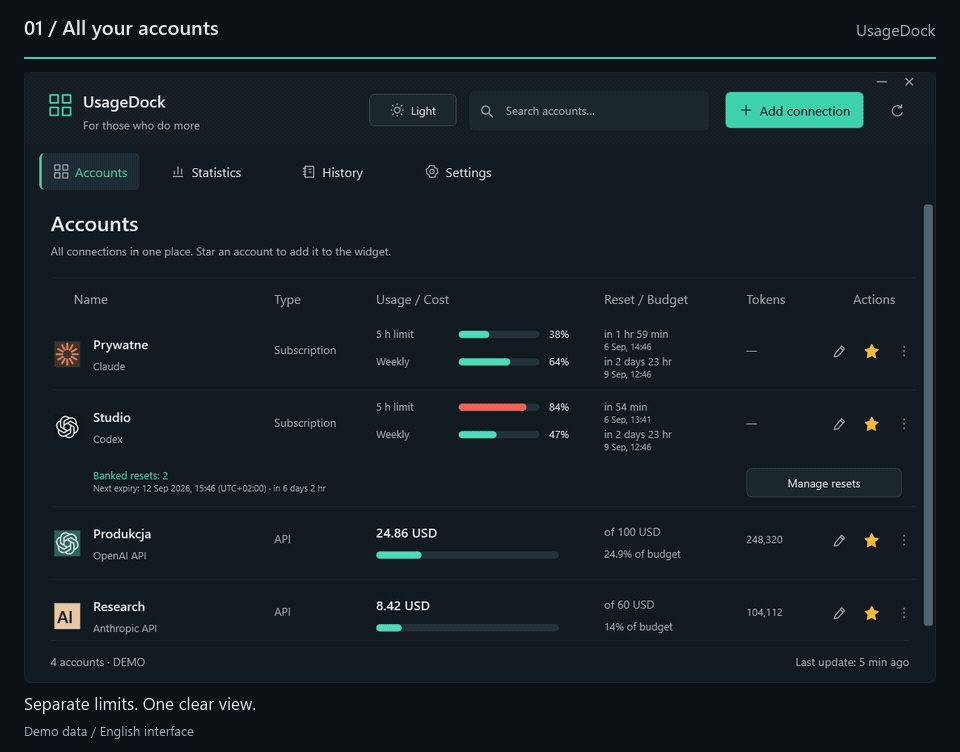
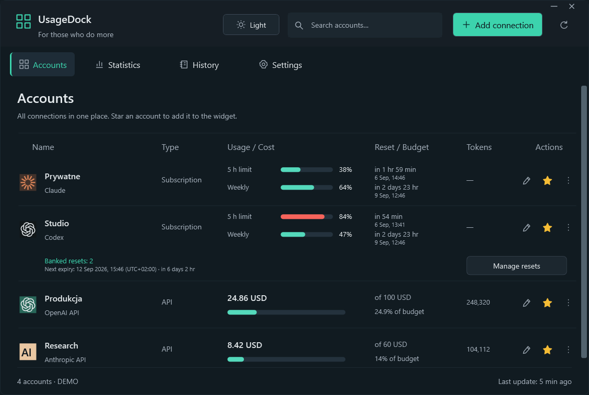
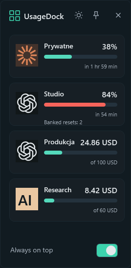
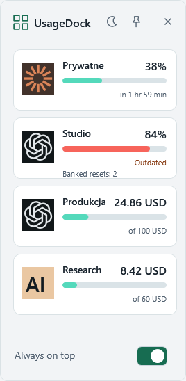
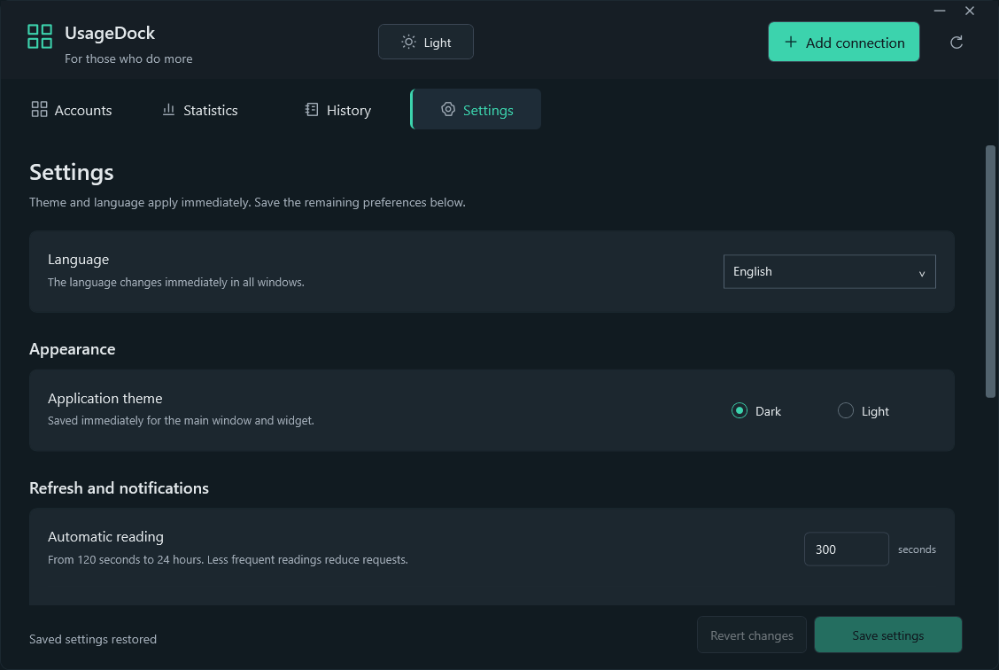

<p align="center"></p>
<h1 align="center">UsageDock</h1>
<p align="center"><strong>Your AI accounts. One place on your desktop.</strong></p>
<p align="center">Claude and Codex limits, banked resets and API spending — in a native Windows dashboard and pinned widget.</p>

<p align="center"><strong>English</strong> · <a href="docs/readme/pl.md">Polski</a> · <a href="docs/readme/de.md">Deutsch</a> · <a href="docs/readme/fr.md">Français</a> · <a href="docs/readme/es.md">Español</a></p>

<p align="center">
  <a href="https://github.com/legitedeV/UsageDock/actions/workflows/ci.yml"></a>
  <a href="https://github.com/legitedeV/UsageDock/releases/latest"></a>
  <a href="LICENSE"></a>
  
</p>

<p align="center"><a href="https://github.com/legitedeV/UsageDock/releases/latest"><strong>Download for Windows</strong></a> · <a href="CONTRIBUTING.md">Contribute</a></p>

<p align="center"><picture><source media="(prefers-reduced-motion: reduce)" srcset="docs/screenshots/en/dashboard.png"></picture></p>
<p align="center"><sub>Actual app renders with synthetic accounts. This tour shows the English interface.</sub></p>

<details>
<summary>Prefer still images? Open the dashboard and widget</summary>

<p align="center"></p>
<p align="center"></p>

</details>

## Keep your usage in sight

| Track | In UsageDock |
|---|---|
| **Accounts** | Named Claude and Codex connections in one searchable view. |
| **Resets** | Precise countdowns, local dates and time-zone offsets; banked Codex reset inventory and explicit redemption. |
| **API spending** | Month-to-date costs, reported tokens and optional local budgets, with supported workspace or project filters. |
| **Your desktop** | Favorite accounts in an always-on-top widget, with instant light and dark themes. |
| **Your language** | English, Polish, German, French and Spanish throughout the app and installer. |

Built with **C# / WPF and .NET 8**. No Electron runtime, UsageDock cloud account or telemetry.

## Five languages, no restart

**New in 0.5.0:** choose **Settings → Language** to switch every window, the widget and tray menu immediately. Dates and numbers follow the selected language; your account names stay unchanged.

**Automatic** follows the Windows display language, with English as the fallback. New installations use Automatic. Existing installations keep Polish until you change the preference.

<p align="center"></p>

## Install and connect

**Windows 11 x64** · release downloads include the .NET runtime.

1. Open the [latest release](https://github.com/legitedeV/UsageDock/releases/latest) and download the **installer** (`-setup.exe`) or **portable ZIP**.
2. Run the per-user installer, or extract the entire ZIP and launch `UsageDock.exe`.
3. Select **Add connection**, name your account, and enter a credential or explicitly choose a supported CLI credential file.
4. Refresh, star your favorite accounts, and open **Mini widget** from the tray menu.

To explore without connecting an account: `UsageDock.exe --demo`.

Builds are **unsigned**. Check the download against `SHA256SUMS.txt` from the same trusted release. The ZIP is portable as an application package; saved credentials remain tied to your Windows user and machine.

## Supported connections

| Connection | Displays | Requires |
|---|---|---|
| **Claude OAuth** | Subscription usage and reset windows | Existing access token or supported CLI credential file. |
| **Claude web session** | Organization subscription usage | Session key and organization ID. |
| **Codex / ChatGPT account** | Codex windows and banked resets | Codex access token and applicable account ID. |
| **Anthropic API** | Organization costs and messages tokens | Admin API key; optional workspace filter. |
| **OpenAI API** | Organization costs and completions tokens | Organization Admin API key; optional project filter. |

**Codex limits are not general ChatGPT conversation quotas.** Subscription integrations are experimental and may change. Connect only accounts you own or administer. Built-in OAuth login and automatic token renewal are not implemented.

Unavailable data is never replaced with a made-up zero. API budgets are local thresholds, not provider spending caps; reporting uses UTC month boundaries. History records the current session, not a persistent billing archive.

A banked reset is consumed only after an account-specific confirmation. Uncertain results retain the same request ID across restarts for an explicit retry; the app never automatically consumes another reset. Provider availability and idempotency remain external dependencies. See the [integration contracts](docs/INTEGRATIONS.md).

## Local credentials, direct connections

UsageDock talks directly to your configured providers. Credentials are encrypted at rest with **Windows DPAPI** for your Windows user. There is no UsageDock server.

Do not include credentials, raw provider responses or private-account screenshots in issues. Use [private vulnerability reporting](https://github.com/legitedeV/UsageDock/security/advisories/new) for security reports; read the [security model](SECURITY.md).

## Build and contribute

Clone the repository on Windows and install the **.NET 8 SDK**. Run these commands from the repository root:

```powershell
powershell -NoProfile -ExecutionPolicy Bypass -File .\scripts\build.ps1
powershell -NoProfile -ExecutionPolicy Bypass -File .\scripts\test.ps1
powershell -NoProfile -ExecutionPolicy Bypass -File .\scripts\verify-ui.ps1
```

Core tests enforce **80% minimum line coverage**. The separate UI task checks desktop flows and generates screenshots using synthetic data, without real credentials or reset consumption. See [verification scope](docs/VERIFICATION.md).

Bug fixes, accessibility improvements and translations are welcome. The five UTF-8 catalogs live in `src/UsageDock.Core/Localization/`; preserve keys and numbered placeholders. Start with [CONTRIBUTING.md](CONTRIBUTING.md), [report an issue](https://github.com/legitedeV/UsageDock/issues/new/choose), or read the [release notes](CHANGELOG.md).

---

[MIT licensed](LICENSE). Independent community project; not affiliated with Anthropic or OpenAI.
