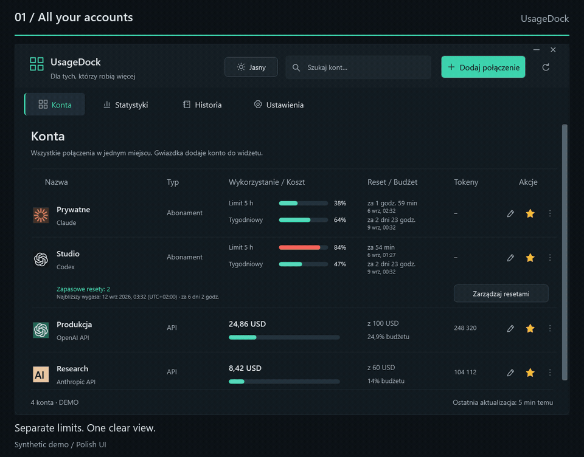
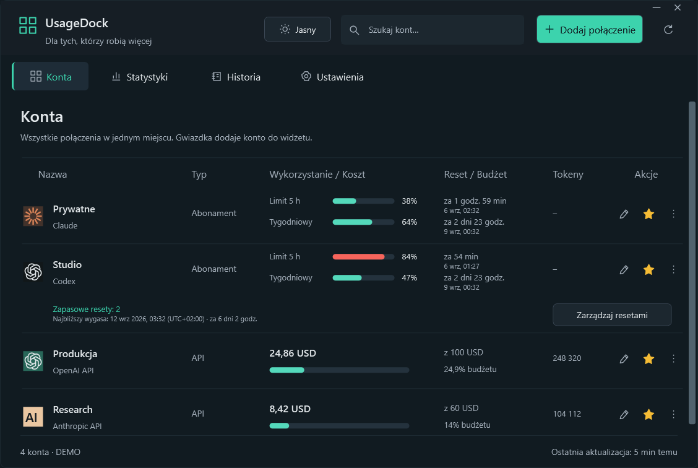

<h1 align="center">UsageDock</h1>
<p align="center"><strong>Your AI accounts. One place on your desktop.</strong></p>
<p align="center">Claude and Codex limits, banked resets, and API spending — in a native Windows dashboard and pinned widget.</p>

<p align="center">
  <a href="https://github.com/legitedeV/UsageDock/actions/workflows/ci.yml"></a>
  <a href="https://github.com/legitedeV/UsageDock/releases/latest"></a>
  <a href="LICENSE"></a>
  
</p>

<p align="center">
  <a href="https://github.com/legitedeV/UsageDock/releases/latest"><strong>Download for Windows</strong></a> ·
  <a href="#what-you-can-see">Features</a> ·
  <a href="#supported-connections">Connections</a> ·
  <a href="docs/GETTING_STARTED_PL.md">Instrukcja po polsku</a> ·
  <a href="CONTRIBUTING.md">Contribute</a>
</p>

<p align="center"><picture><source media="(prefers-reduced-motion: reduce)" srcset="docs/screenshots/dashboard.png"></picture></p>
<p align="center"><sub>Actual app renders with synthetic demo data. The current application interface is in Polish.</sub></p>

<details>
<summary>Prefer still images? View the dashboard and widget</summary>

<picture>
  <source media="(prefers-color-scheme: dark)" srcset="docs/screenshots/dashboard.png">
  <source media="(prefers-color-scheme: light)" srcset="docs/screenshots/dashboard-light.png">
  
</picture>

<p align="center">
  
  
</p>

[Statistics](docs/screenshots/statistics.png) · [History](docs/screenshots/history.png) · [Settings](docs/screenshots/settings.png) · [Banked resets](docs/screenshots/resets.png)

</details>

## What you can see

Switching between accounts should not mean opening a different browser session every time you want to check a limit.

| Keep track of | In UsageDock |
|---|---|
| **Multiple accounts** | Named Claude and Codex connections in one searchable view. |
| **Your next reset** | Local dates and times, precise countdowns, and the correct time-zone offset. |
| **Banked Codex resets** | Available count, grant and expiry dates, and explicit redemption with an account-specific confirmation. |
| **API spending** | Month-to-date costs, reported tokens and optional local budgets; workspace or project filters where supported. |
| **A desktop widget** | Pin favorite accounts and keep the compact window above other applications. |
| **Your preferred theme** | Light and dark themes, switched instantly from the dashboard or widget. |

Built with **C# / WPF and .NET 8**. No Electron runtime, UsageDock cloud account or telemetry. Provider credentials stay on your machine and are encrypted with Windows DPAPI.

## Get started

**Windows 11 x64** · no separate .NET installation needed for release downloads.

1. Open the [latest release](https://github.com/legitedeV/UsageDock/releases/latest).
2. Download the **installer** (`-setup.exe`) or **portable ZIP**. The installer runs for the current Windows user; extract the complete ZIP before launching `UsageDock.exe`.
3. Choose **Dodaj połączenie** (Add connection), name the account and enter a credential or explicitly select a supported CLI credential file.
4. Refresh your connections. Star the accounts you want in the widget, then open **Mini widget** from the tray menu.

You can explore the interface without connecting an account:

```powershell
.\UsageDock.exe --demo
```

The ZIP is portable as an application package; saved credentials remain tied to your Windows user and machine. Builds are currently unsigned. Verify the download against `SHA256SUMS.txt` from the same trusted release.

## Supported connections

| Provider | What is displayed | What you need |
|---|---|---|
| **Claude OAuth** | Subscription usage and reset windows | An existing Claude access token or a supported CLI credential file. |
| **Claude web session** | Organization-specific subscription usage | Your session key and organization ID. |
| **Codex / ChatGPT account** | Codex allowance windows and banked reset credits | A Codex access token and the applicable ChatGPT account ID. |
| **Anthropic API** | Organization costs and messages token usage | An Admin API key; optional workspace filter. |
| **OpenAI API** | Organization costs and completions token usage | An organization Admin API key; optional project filter. |

**Codex allowances are not general ChatGPT conversation quotas.** Subscription integrations use experimental endpoints and can change without notice. Only connect accounts you own or administer. Expired credentials must be reconnected; automatic OAuth login and token renewal are not implemented.

Unavailable data stays unavailable — it is never replaced with a made-up zero. API budgets are local thresholds, not provider spending caps. API reporting uses UTC month boundaries. Statistics and history cover the current app session, not a persistent billing archive.

<details>
<summary>How banked reset redemption works</summary>

Choose **Zarządzaj resetami** (Manage resets) on a Codex account to inspect each credit. **Użyj resetu** (Use reset) asks you to confirm the account and selected expiry before sending a request. A banked reset can refresh eligible five-hour and weekly windows; this action does not buy credits.

UsageDock checks availability before sending. If the result is uncertain, it retains the same request identifier across restarts so an explicit retry can resolve that attempt. It never automatically consumes another reset. Provider availability and idempotency remain external dependencies.

See the [integration contracts](docs/INTEGRATIONS.md) for technical details.

</details>

## Local by design

There is no UsageDock server. The app talks directly to the configured provider, with secrets encrypted at rest for the current Windows user. Demo screenshots and tests use synthetic accounts.

Do not publish credential files, raw provider responses or screenshots of private accounts in issues. Report vulnerabilities through [private vulnerability reporting](https://github.com/legitedeV/UsageDock/security/advisories/new). See [SECURITY.md](SECURITY.md) for the security model and limitations.

## Build and contribute

Use Windows and the **.NET 8 SDK**:

```powershell
git clone https://github.com/legitedeV/UsageDock.git
cd UsageDock
powershell -NoProfile -ExecutionPolicy Bypass -File .\scripts\build.ps1
powershell -NoProfile -ExecutionPolicy Bypass -File .\scripts\test.ps1
powershell -NoProfile -ExecutionPolicy Bypass -File .\scripts\verify-ui.ps1
```

The Core test task enforces **at least 80% line coverage**. The separate UI task checks the WPF/controller flows and generates screenshots; it does not consume real resets or access real account credentials. [Verification notes](docs/VERIFICATION.md) record the scope and limitations.

| Area | Location |
|---|---|
| Providers, models and encrypted storage | `src/UsageDock.Core` |
| Native dashboard, widget and Windows integration | `src/UsageDock.App` |
| Synthetic provider and storage tests | `tests/UsageDock.Core.Tests` |
| Build, UI checks and release packaging | `scripts` |

Bug reports, integration fixes, accessibility improvements and documentation contributions are welcome. Start with the [contribution guide](CONTRIBUTING.md) or [open an issue](https://github.com/legitedeV/UsageDock/issues/new/choose).

<details>
<summary>Package a release or regenerate the animated tour</summary>

```powershell
powershell -NoProfile -ExecutionPolicy Bypass -File .\scripts\package.ps1 -Version 0.4.1
```

The portable package is self-contained. To build the installer too, pass `-InnoSetupCompiler` with the path to Inno Setup 6 and add `-RequireInstaller`. The release workflow validates a version tag, builds and tests on Windows, and prepares a draft release.

The README tour is assembled from synthetic screenshots with FFmpeg:

```powershell
powershell -NoProfile -ExecutionPolicy Bypass -File .\scripts\render-readme-demo.ps1
```

</details>

---

[MIT licensed](LICENSE). Independent community project; not affiliated with Anthropic or OpenAI.
