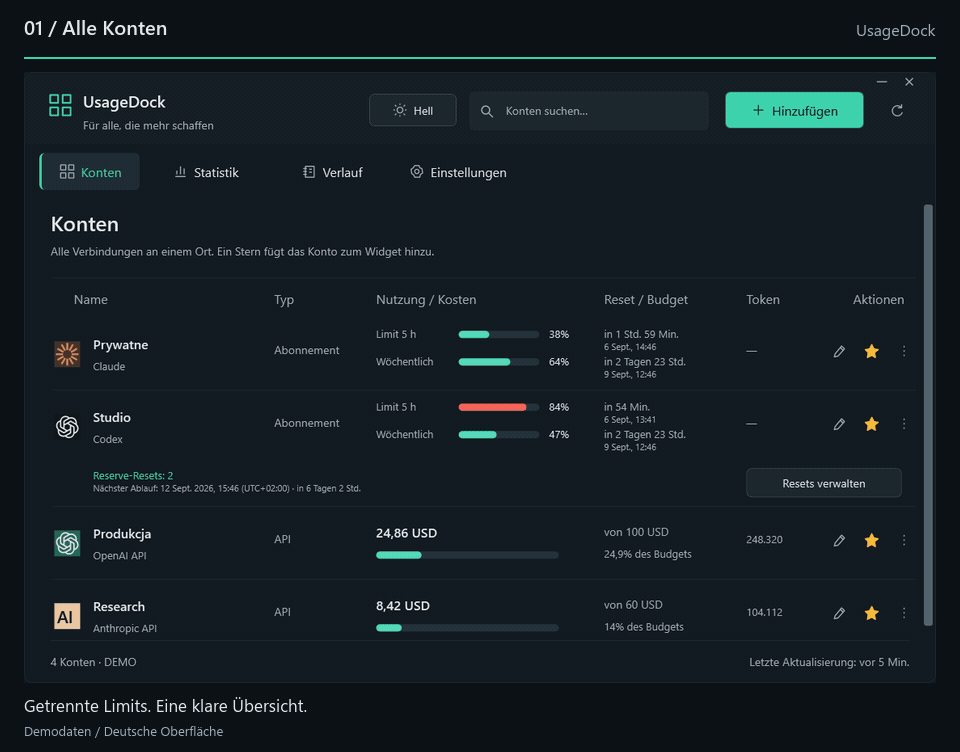
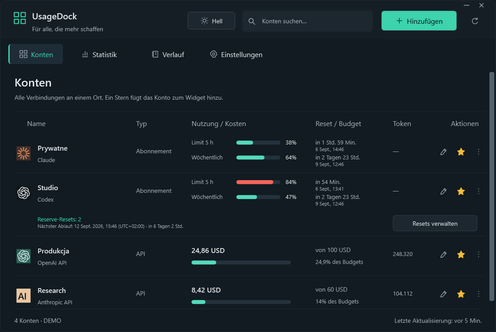
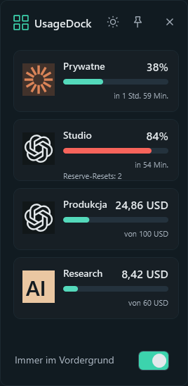
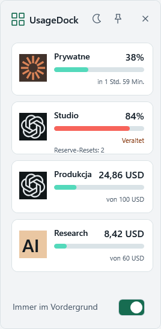
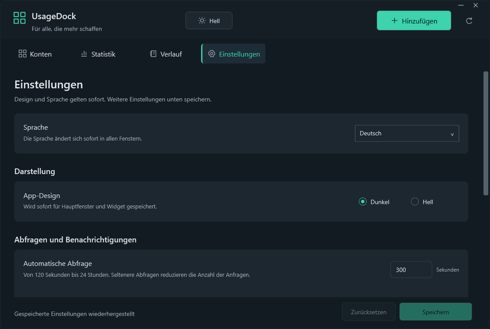

<p align="center"></p>
<h1 align="center">UsageDock</h1>
<p align="center"><strong>Deine KI-Konten. Ein Ort auf deinem Desktop.</strong></p>
<p align="center">Claude- und Codex-Limits, Reserve-Resets und API-Kosten — in einer nativen Windows-App mit angeheftetem Widget.</p>

<p align="center"><a href="../../README.md">English</a> · <a href="pl.md">Polski</a> · <strong>Deutsch</strong> · <a href="fr.md">Français</a> · <a href="es.md">Español</a></p>

<p align="center">
  <a href="https://github.com/legitedeV/UsageDock/actions/workflows/ci.yml"></a>
  <a href="https://github.com/legitedeV/UsageDock/releases/latest"></a>
  <a href="../../LICENSE"></a>
  
</p>

<p align="center"><a href="https://github.com/legitedeV/UsageDock/releases/latest"><strong>Für Windows herunterladen</strong></a> · <a href="../../CONTRIBUTING.md">Mitwirken</a></p>

<p align="center"><picture><source media="(prefers-reduced-motion: reduce)" srcset="../../docs/screenshots/de/dashboard.png"></picture></p>
<p align="center"><sub>Echte App-Ansichten mit synthetischen Konten. Diese Tour zeigt die deutsche Oberfläche.</sub></p>

<details>
<summary>Lieber Standbilder? Übersicht und Widget ansehen</summary>

<p align="center"></p>
<p align="center"></p>

</details>

## Die Nutzung im Blick behalten

| Bereich | In UsageDock |
|---|---|
| **Konten** | Benannte Claude- und Codex-Verbindungen in einer durchsuchbaren Übersicht. |
| **Resets** | Präzise Countdowns, lokale Datumsangaben und Zeitzonenoffsets; Bestand und ausdrückliche Einlösung von Codex-Reserve-Resets. |
| **API-Kosten** | Kosten seit Monatsbeginn, gemeldete Token und optionale lokale Budgets mit unterstützten Arbeitsbereichs- oder Projektfiltern. |
| **Desktop** | Favoriten in einem Widget, das im Vordergrund bleibt, mit sofort wechselbarem hellem und dunklem Design. |
| **Sprache** | Deutsch, Englisch, Polnisch, Französisch und Spanisch in der gesamten App und im Installer. |

Entwickelt mit **C# / WPF und .NET 8**. Ohne Electron, UsageDock-Cloud-Konto oder Telemetrie.

## Fünf Sprachen ohne Neustart

**Neu in 0.5.0:** Unter **Einstellungen → Sprache** wechseln alle Fenster, das Widget und das Infobereichsmenü sofort die Sprache. Datumsangaben und Zahlen folgen der gewählten Sprache; deine Kontonamen bleiben unverändert.

**Automatisch** verwendet die Windows-Anzeigesprache und bei nicht unterstützten Sprachen Englisch. Neue Installationen nutzen diese Einstellung. Bestehende Installationen behalten Polnisch, bis du die Auswahl änderst.

<p align="center"></p>

## Installieren und verbinden

**Windows 11 x64** · die Downloads enthalten die .NET-Laufzeit.

1. Öffne die [neueste Version](https://github.com/legitedeV/UsageDock/releases/latest) und lade den **Installer** (`-setup.exe`) oder das **portable ZIP-Archiv** herunter.
2. Führe den Installer für dein Windows-Konto aus oder entpacke das gesamte Archiv und starte `UsageDock.exe`.
3. Wähle **Hinzufügen**, benenne das Konto und gib Zugangsdaten ein oder wähle ausdrücklich eine unterstützte CLI-Zugangsdaten-Datei.
4. Aktualisiere die Daten, markiere Favoriten mit einem Stern und öffne **Mini-Widget** im Infobereichsmenü.

Oberfläche ohne verbundenes Konto erkunden: `UsageDock.exe --demo`.

Die Builds sind **nicht digital signiert**. Vergleiche den Download mit `SHA256SUMS.txt` derselben vertrauenswürdigen Veröffentlichung. Portabel ist das Anwendungspaket; gespeicherte Zugangsdaten bleiben an deinen Windows-Benutzer und Computer gebunden.

## Unterstützte Verbindungen

| Verbindung | Anzeige | Voraussetzung |
|---|---|---|
| **Claude OAuth** | Abonnementnutzung und Reset-Zeitfenster | Vorhandenes Zugriffstoken oder unterstützte CLI-Zugangsdaten-Datei. |
| **Claude-Websitzung** | Abonnementnutzung der Organisation | Sitzungsschlüssel und Organisations-ID. |
| **Codex / ChatGPT-Konto** | Codex-Zeitfenster und Reserve-Resets | Codex-Zugriffstoken und passende Konto-ID. |
| **Anthropic API** | Organisationskosten und Nachrichten-Token | Admin-API-Schlüssel; optionaler Arbeitsbereichsfilter. |
| **OpenAI API** | Organisationskosten und Completions-Token | Admin-API-Schlüssel der Organisation; optionaler Projektfilter. |

**Codex-Limits sind keine allgemeinen ChatGPT-Gesprächskontingente.** Die Abonnementintegrationen sind experimentell und können sich ändern. Verbinde nur eigene oder von dir verwaltete Konten. Eine integrierte OAuth-Anmeldung und automatische Token-Erneuerung sind nicht implementiert.

Fehlende Daten werden niemals durch eine erfundene Null ersetzt. API-Budgets sind lokale Schwellenwerte, keine Ausgabenlimits beim Anbieter; Berichte verwenden UTC-Monatsgrenzen. Der Verlauf umfasst die aktuelle Sitzung und ist kein dauerhaftes Abrechnungsarchiv.

Ein Reserve-Reset wird erst nach einer kontospezifischen Bestätigung verbraucht. Bei ungewissem Ergebnis bleibt dieselbe Anfrage-ID über Neustarts hinweg für eine ausdrückliche Wiederholung erhalten; die App verbraucht niemals automatisch einen weiteren Reset. Verfügbarkeit und Idempotenz hängen weiterhin vom Anbieter ab. Details stehen in den [Integrationsverträgen](../../docs/INTEGRATIONS.md).

## Lokale Zugangsdaten, direkte Verbindungen

UsageDock kommuniziert direkt mit den konfigurierten Anbietern. Gespeicherte Zugangsdaten werden durch **Windows DPAPI** für deinen Windows-Benutzer verschlüsselt. Es gibt keinen UsageDock-Server.

Veröffentliche keine Zugangsdaten, unverarbeiteten Anbieterantworten oder Screenshots privater Konten in Issues. Melde Sicherheitslücken [vertraulich](https://github.com/legitedeV/UsageDock/security/advisories/new) und lies das [Sicherheitsmodell](../../SECURITY.md).

## Bauen und mitwirken

Klone das Repository unter Windows und installiere das **.NET 8 SDK**. Führe diese Befehle im Hauptverzeichnis des Repositorys aus:

```powershell
powershell -NoProfile -ExecutionPolicy Bypass -File .\scripts\build.ps1
powershell -NoProfile -ExecutionPolicy Bypass -File .\scripts\test.ps1
powershell -NoProfile -ExecutionPolicy Bypass -File .\scripts\verify-ui.ps1
```

Die Core-Tests verlangen **mindestens 80 % Zeilenabdeckung**. Die separate UI-Prüfung testet Desktop-Abläufe und erstellt Screenshots mit synthetischen Daten, ohne echte Zugangsdaten oder Reset-Verbrauch. Siehe [Prüfumfang](../../docs/VERIFICATION.md).

Fehlerkorrekturen, Barrierefreiheit und Übersetzungen sind willkommen. Die fünf UTF-8-Kataloge liegen unter `src/UsageDock.Core/Localization/`; Schlüssel und nummerierte Platzhalter müssen erhalten bleiben. Einstieg: [Beitragsleitfaden](../../CONTRIBUTING.md), [Problem melden](https://github.com/legitedeV/UsageDock/issues/new/choose) oder [Änderungsprotokoll](../../CHANGELOG.md).

---

[MIT-Lizenz](../../LICENSE). Unabhängiges Community-Projekt; nicht mit Anthropic oder OpenAI verbunden.
