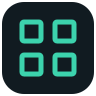
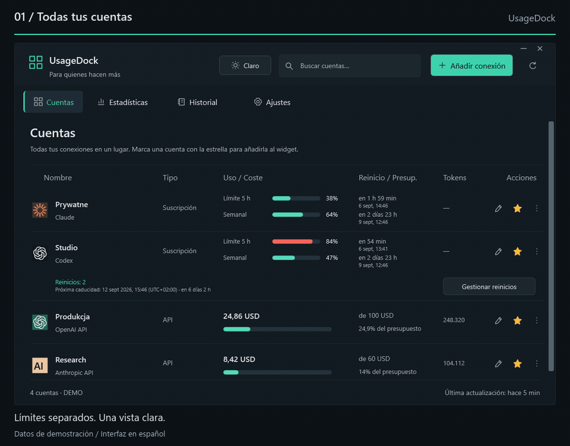
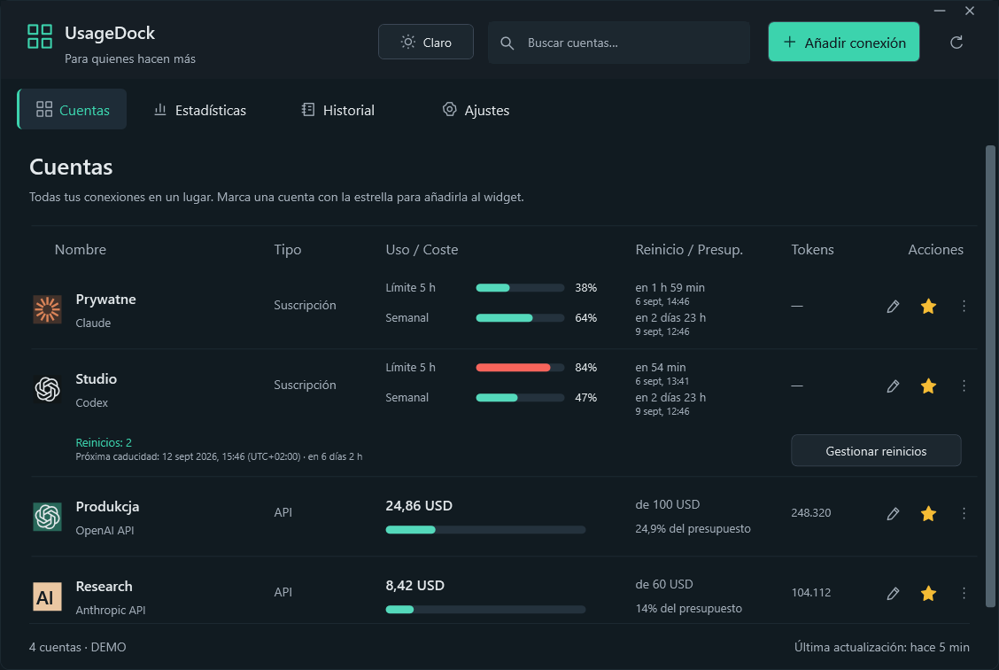
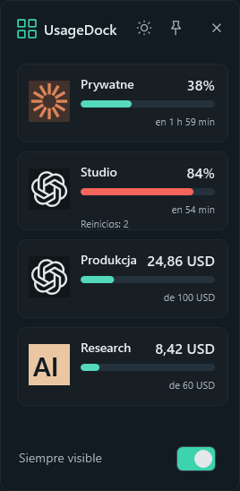
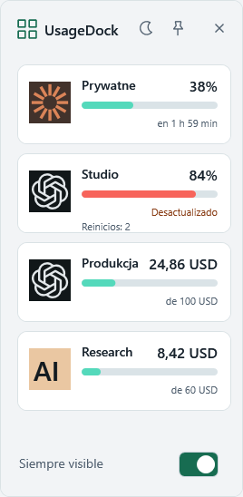
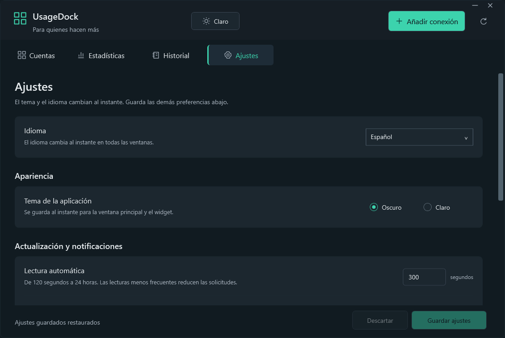

<p align="center"></p>
<h1 align="center">UsageDock</h1>
<p align="center"><strong>Tus cuentas de IA. Un solo lugar en tu escritorio.</strong></p>
<p align="center">Límites de Claude y Codex, reinicios de reserva y gastos de API — en una aplicación nativa de Windows con un miniwidget fijado.</p>

<p align="center"><a href="../../README.md">English</a> · <a href="pl.md">Polski</a> · <a href="de.md">Deutsch</a> · <a href="fr.md">Français</a> · <strong>Español</strong></p>

<p align="center">
  <a href="https://github.com/legitedeV/UsageDock/actions/workflows/ci.yml"></a>
  <a href="https://github.com/legitedeV/UsageDock/releases/latest"></a>
  <a href="../../LICENSE"></a>
  
</p>

<p align="center"><a href="https://github.com/legitedeV/UsageDock/releases/latest"><strong>Descargar para Windows</strong></a> · <a href="../../CONTRIBUTING.md">Contribuir</a></p>

<p align="center"><picture><source media="(prefers-reduced-motion: reduce)" srcset="../../docs/screenshots/es/dashboard.png"></picture></p>
<p align="center"><sub>Vistas reales de la aplicación con cuentas ficticias. Esta presentación muestra la interfaz en español.</sub></p>

<details>
<summary>¿Prefieres imágenes estáticas? Ver el panel y el miniwidget</summary>

<p align="center"></p>
<p align="center"></p>

</details>

## Mantén tu uso a la vista

| Qué seguir | En UsageDock |
|---|---|
| **Cuentas** | Conexiones de Claude y Codex con nombre en una vista común con búsqueda. |
| **Reinicios** | Cuentas atrás precisas, fechas locales y desfases horarios; inventario de reinicios de reserva de Codex y uso confirmado explícitamente. |
| **Gastos de API** | Costes desde el inicio del mes, tokens declarados y presupuestos locales opcionales, con los filtros de espacio o proyecto disponibles. |
| **Escritorio** | Cuentas favoritas en un miniwidget siempre visible, con cambio inmediato entre tema claro y oscuro. |
| **Idioma** | Español, inglés, polaco, alemán y francés en toda la aplicación y el instalador. |

Desarrollado con **C# / WPF y .NET 8**. Sin Electron, cuenta en la nube de UsageDock ni telemetría.

## Cinco idiomas sin reiniciar

**Novedad de la versión 0.5.0:** elige **Ajustes → Idioma** para cambiar inmediatamente el idioma de todas las ventanas, el miniwidget y el menú de la bandeja. Las fechas y los números siguen el idioma elegido; los nombres de tus cuentas no cambian.

**Automático** sigue el idioma de visualización de Windows y usa inglés cuando no está disponible. Las instalaciones nuevas utilizan este ajuste. Las existentes conservan el polaco hasta que cambies la preferencia.

<p align="center"></p>

## Instalar y conectar

**Windows 11 x64** · las descargas incluyen el entorno de ejecución de .NET.

1. Abre la [última versión](https://github.com/legitedeV/UsageDock/releases/latest) y descarga el **instalador** (`-setup.exe`) o el **ZIP portable**.
2. Ejecuta el instalador para tu usuario de Windows, o extrae el archivo completo y abre `UsageDock.exe`.
3. Elige **Añadir conexión**, asigna un nombre a la cuenta e introduce una credencial o selecciona explícitamente un archivo de credenciales CLI compatible.
4. Actualiza los datos, marca tus favoritas con una estrella y abre **Miniwidget** desde el menú de la bandeja.

Para explorar sin conectar ninguna cuenta: `UsageDock.exe --demo`.

Los ejecutables **no están firmados digitalmente**. Comprueba la descarga con `SHA256SUMS.txt` de la misma publicación de confianza. El paquete de la aplicación es portable; las credenciales guardadas siguen vinculadas a tu usuario de Windows y tu equipo.

## Conexiones compatibles

| Conexión | Muestra | Requisitos |
|---|---|---|
| **Claude OAuth** | Uso de la suscripción y ventanas de reinicio | Token de acceso existente o archivo de credenciales CLI compatible. |
| **Sesión web de Claude** | Uso de la suscripción de la organización | Clave de sesión e identificador de organización. |
| **Codex / cuenta de ChatGPT** | Ventanas de Codex y reinicios de reserva | Token de acceso de Codex e identificador de cuenta correspondiente. |
| **Anthropic API** | Costes de la organización y tokens de mensajes | Clave Admin API; filtro de espacio opcional. |
| **OpenAI API** | Costes de la organización y tokens de Completions | Clave Admin API de la organización; filtro de proyecto opcional. |

**Los límites de Codex no son las cuotas generales de conversaciones de ChatGPT.** Las integraciones de suscripción son experimentales y pueden cambiar. Conecta solo cuentas que te pertenezcan o administres. No se ha implementado el inicio de sesión OAuth integrado ni la renovación automática de tokens.

Los datos no disponibles nunca se sustituyen por un cero inventado. Los presupuestos de API son umbrales locales, no límites de gasto del proveedor; los informes utilizan meses UTC. El historial corresponde a la sesión actual, no a un archivo de facturación permanente.

Un reinicio de reserva solo se consume tras confirmar la cuenta correspondiente. Si el resultado es incierto, el mismo identificador de solicitud se conserva entre reinicios para reintentar explícitamente; la aplicación nunca consume otro reinicio de forma automática. La disponibilidad y la idempotencia siguen dependiendo del proveedor. Consulta los [contratos de integración](../../docs/INTEGRATIONS.md).

## Credenciales locales, conexiones directas

UsageDock se comunica directamente con los proveedores configurados. Las credenciales guardadas se cifran con **Windows DPAPI** para tu usuario de Windows. No existe ningún servidor de UsageDock.

No publiques credenciales, respuestas sin procesar de los proveedores ni capturas de cuentas privadas en incidencias. Comunica las vulnerabilidades [en privado](https://github.com/legitedeV/UsageDock/security/advisories/new) y consulta el [modelo de seguridad](../../SECURITY.md).

## Compilar y contribuir

Clona el repositorio en Windows e instala el **SDK de .NET 8**. Ejecuta estos comandos desde la raíz del repositorio:

```powershell
powershell -NoProfile -ExecutionPolicy Bypass -File .\scripts\build.ps1
powershell -NoProfile -ExecutionPolicy Bypass -File .\scripts\test.ps1
powershell -NoProfile -ExecutionPolicy Bypass -File .\scripts\verify-ui.ps1
```

Los tests Core exigen **un mínimo del 80 % de cobertura de líneas**. La tarea UI independiente comprueba los flujos de escritorio y genera capturas con datos ficticios, sin credenciales reales ni consumo de reinicios. Consulta el [alcance de la verificación](../../docs/VERIFICATION.md).

Las correcciones, mejoras de accesibilidad y traducciones son bienvenidas. Los cinco catálogos UTF-8 están en `src/UsageDock.Core/Localization/`; conserva las claves y los parámetros numerados. Empieza por la [guía de contribución](../../CONTRIBUTING.md), [informa de un problema](https://github.com/legitedeV/UsageDock/issues/new/choose) o lee el [registro de cambios](../../CHANGELOG.md).

---

[Licencia MIT](../../LICENSE). Proyecto comunitario independiente, sin afiliación con Anthropic ni OpenAI.
