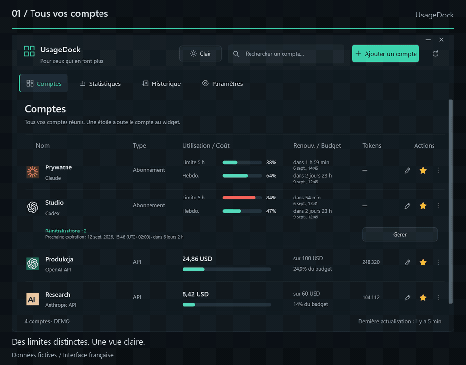
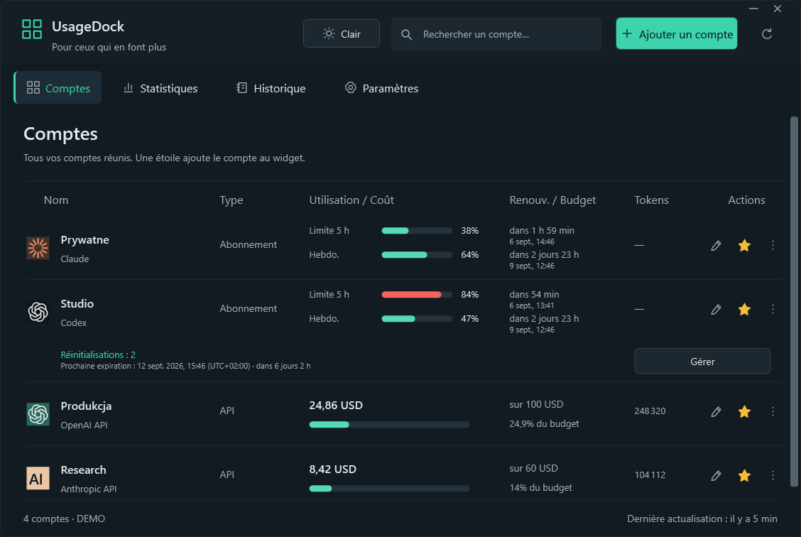
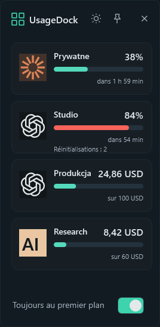
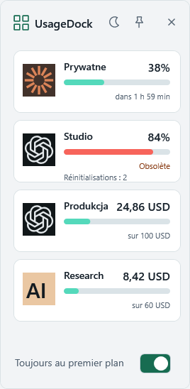
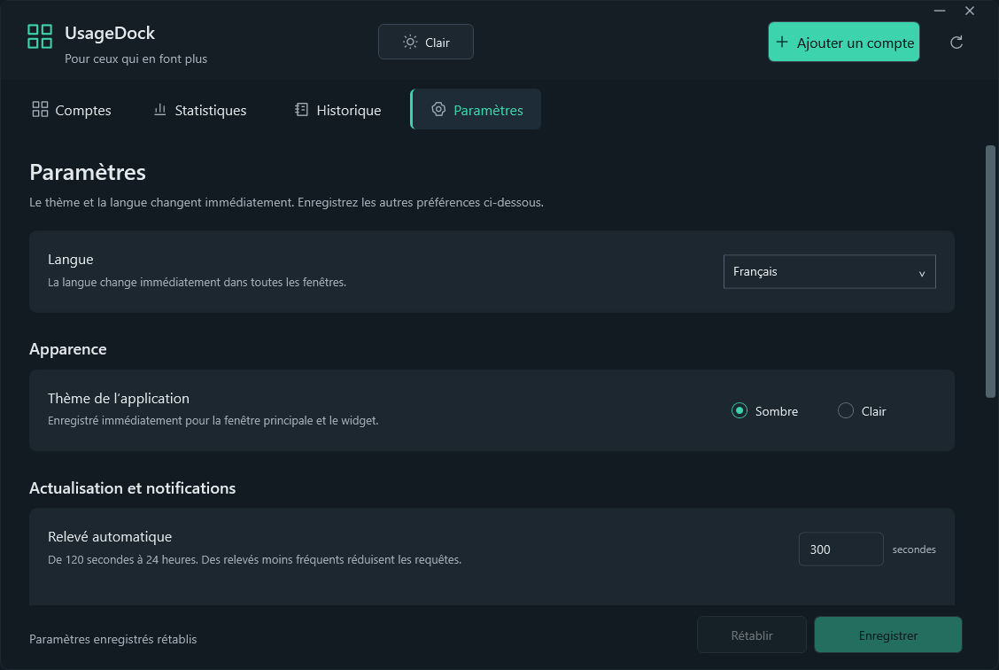

<p align="center"></p>
<h1 align="center">UsageDock</h1>
<p align="center"><strong>Vos comptes IA. Un seul endroit sur votre bureau.</strong></p>
<p align="center">Limites Claude et Codex, réinitialisations en réserve et dépenses API — dans une application Windows native avec widget épinglé.</p>

<p align="center"><a href="../../README.md">English</a> · <a href="pl.md">Polski</a> · <a href="de.md">Deutsch</a> · <strong>Français</strong> · <a href="es.md">Español</a></p>

<p align="center">
  <a href="https://github.com/legitedeV/UsageDock/actions/workflows/ci.yml"></a>
  <a href="https://github.com/legitedeV/UsageDock/releases/latest"></a>
  <a href="../../LICENSE"></a>
  
</p>

<p align="center"><a href="https://github.com/legitedeV/UsageDock/releases/latest"><strong>Télécharger pour Windows</strong></a> · <a href="../../CONTRIBUTING.md">Contribuer</a></p>

<p align="center"><picture><source media="(prefers-reduced-motion: reduce)" srcset="../../docs/screenshots/fr/dashboard.png"></picture></p>
<p align="center"><sub>Vues réelles de l’application avec des comptes fictifs. Cette présentation montre l’interface française.</sub></p>

<details>
<summary>Vous préférez des images fixes ? Voir le tableau de bord et le widget</summary>

<p align="center"></p>
<p align="center"></p>

</details>

## Gardez votre utilisation à portée de vue

| À suivre | Dans UsageDock |
|---|---|
| **Comptes** | Connexions Claude et Codex nommées dans une vue commune avec recherche. |
| **Réinitialisations** | Décomptes précis, dates locales et décalages horaires ; réserve de réinitialisations Codex et utilisation explicitement confirmée. |
| **Dépenses API** | Coûts depuis le début du mois, jetons déclarés et budgets locaux facultatifs, avec filtres d’espace ou de projet pris en charge. |
| **Bureau** | Comptes favoris dans un widget toujours au premier plan, avec thèmes clair et sombre instantanés. |
| **Langue** | Français, anglais, polonais, allemand et espagnol dans toute l’application et l’installateur. |

Développé avec **C# / WPF et .NET 8**. Sans Electron, compte cloud UsageDock ni télémétrie.

## Cinq langues sans redémarrage

**Nouveauté de la version 0.5.0 :** choisissez **Paramètres → Langue** pour changer immédiatement la langue de toutes les fenêtres, du widget et du menu de notification. Dates et nombres suivent la langue choisie ; vos noms de comptes restent inchangés.

**Automatique** suit la langue d’affichage de Windows et utilise l’anglais si elle n’est pas prise en charge. Ce réglage s’applique aux nouvelles installations. Les installations existantes conservent le polonais jusqu’à votre choix d’une autre langue.

<p align="center"></p>

## Installer et connecter

**Windows 11 x64** · les téléchargements incluent l’environnement .NET.

1. Ouvrez la [dernière version](https://github.com/legitedeV/UsageDock/releases/latest) et téléchargez l’**installateur** (`-setup.exe`) ou l’**archive ZIP portable**.
2. Lancez l’installateur pour votre utilisateur Windows, ou extrayez toute l’archive et ouvrez `UsageDock.exe`.
3. Choisissez **Ajouter un compte**, donnez-lui un nom et saisissez un identifiant d’accès ou sélectionnez explicitement un fichier d’identifiants CLI pris en charge.
4. Actualisez les données, marquez vos favoris d’une étoile et ouvrez **Mini-widget** depuis le menu de notification.

Pour explorer sans connecter de compte : `UsageDock.exe --demo`.

Les exécutables sont **non signés numériquement**. Vérifiez le téléchargement avec `SHA256SUMS.txt` provenant de la même publication de confiance. Le paquet applicatif est portable ; les identifiants enregistrés restent liés à votre utilisateur Windows et à votre ordinateur.

## Connexions prises en charge

| Connexion | Affichage | Prérequis |
|---|---|---|
| **Claude OAuth** | Utilisation de l’abonnement et fenêtres de réinitialisation | Jeton d’accès existant ou fichier d’identifiants CLI pris en charge. |
| **Session web Claude** | Utilisation de l’abonnement de l’organisation | Clé de session et identifiant d’organisation. |
| **Codex / compte ChatGPT** | Fenêtres Codex et réinitialisations en réserve | Jeton d’accès Codex et identifiant de compte approprié. |
| **Anthropic API** | Coûts de l’organisation et jetons de messages | Clé Admin API ; filtre d’espace facultatif. |
| **OpenAI API** | Coûts de l’organisation et jetons Completions | Clé Admin API de l’organisation ; filtre de projet facultatif. |

**Les limites Codex ne sont pas les quotas généraux des conversations ChatGPT.** Les intégrations d’abonnement sont expérimentales et peuvent évoluer. Connectez uniquement les comptes que vous possédez ou administrez. La connexion OAuth intégrée et le renouvellement automatique des jetons ne sont pas implémentés.

Une donnée indisponible n’est jamais remplacée par un zéro inventé. Les budgets API sont des seuils locaux, pas des plafonds de dépenses chez le fournisseur ; les rapports suivent les mois UTC. L’historique concerne la session actuelle, sans constituer une archive de facturation permanente.

Une réinitialisation en réserve n’est consommée qu’après confirmation pour le compte concerné. En cas de résultat incertain, le même identifiant de requête est conservé après redémarrage pour une nouvelle tentative explicite ; l’application ne consomme jamais automatiquement une autre réinitialisation. Disponibilité et idempotence dépendent toujours du fournisseur. Consultez les [contrats d’intégration](../../docs/INTEGRATIONS.md).

## Identifiants locaux, connexions directes

UsageDock communique directement avec les fournisseurs configurés. Les identifiants enregistrés sont chiffrés avec **Windows DPAPI** pour votre utilisateur Windows. Il n’existe aucun serveur UsageDock.

Ne publiez pas d’identifiants, de réponses brutes des fournisseurs ni de captures de comptes privés dans les tickets. Signalez les vulnérabilités [en privé](https://github.com/legitedeV/UsageDock/security/advisories/new) et consultez le [modèle de sécurité](../../SECURITY.md).

## Compiler et contribuer

Clonez le dépôt sous Windows et installez le **SDK .NET 8**. Exécutez ces commandes à la racine du dépôt :

```powershell
powershell -NoProfile -ExecutionPolicy Bypass -File .\scripts\build.ps1
powershell -NoProfile -ExecutionPolicy Bypass -File .\scripts\test.ps1
powershell -NoProfile -ExecutionPolicy Bypass -File .\scripts\verify-ui.ps1
```

Les tests Core exigent **au moins 80 % de couverture des lignes**. La tâche UI séparée vérifie les parcours de l’application et produit des captures à partir de données fictives, sans identifiants réels ni consommation de réinitialisations. Voir la [portée des vérifications](../../docs/VERIFICATION.md).

Corrections, accessibilité et traductions sont les bienvenues. Les cinq catalogues UTF-8 se trouvent dans `src/UsageDock.Core/Localization/` ; conservez les clés et les paramètres numérotés. Commencez par le [guide de contribution](../../CONTRIBUTING.md), [signalez un problème](https://github.com/legitedeV/UsageDock/issues/new/choose) ou lisez le [journal des modifications](../../CHANGELOG.md).

---

[Sous licence MIT](../../LICENSE). Projet communautaire indépendant, sans affiliation à Anthropic ou OpenAI.
