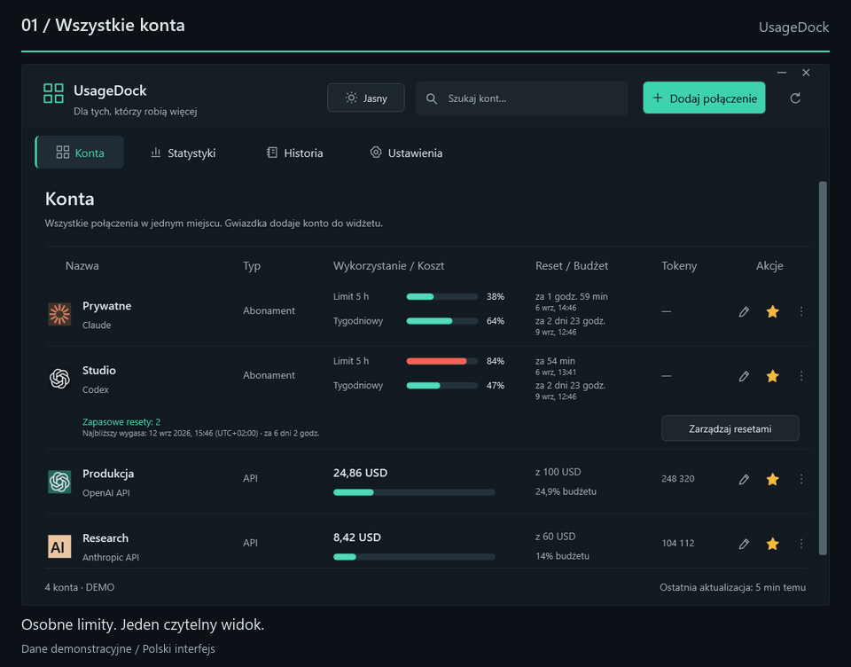
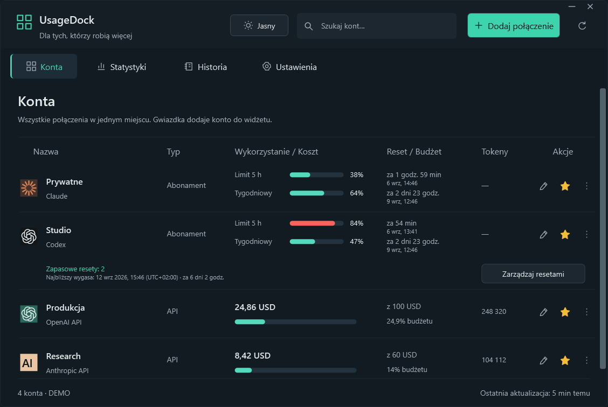
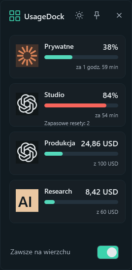
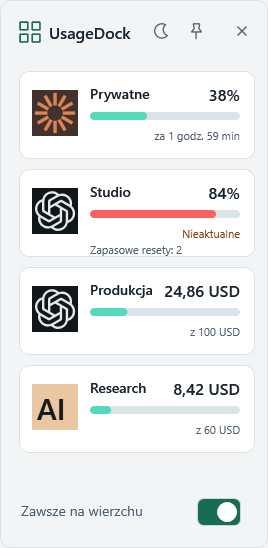
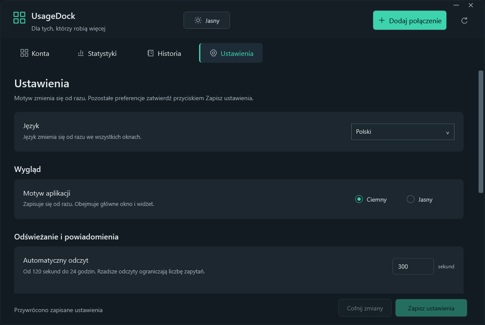

<p align="center"></p>
<h1 align="center">UsageDock</h1>
<p align="center"><strong>Twoje konta AI. Jedno miejsce na pulpicie.</strong></p>
<p align="center">Limity Claude i Codex, zapasowe resety oraz koszty API — w natywnej aplikacji Windows i przypiętym widżecie.</p>

<p align="center"><a href="../../README.md">English</a> · <strong>Polski</strong> · <a href="de.md">Deutsch</a> · <a href="fr.md">Français</a> · <a href="es.md">Español</a></p>

<p align="center">
  <a href="https://github.com/legitedeV/UsageDock/actions/workflows/ci.yml"></a>
  <a href="https://github.com/legitedeV/UsageDock/releases/latest"></a>
  <a href="../../LICENSE"></a>
  
</p>

<p align="center"><a href="https://github.com/legitedeV/UsageDock/releases/latest"><strong>Pobierz dla Windows</strong></a> · <a href="../../CONTRIBUTING.md">Dołącz do rozwoju</a></p>

<p align="center"><picture><source media="(prefers-reduced-motion: reduce)" srcset="../../docs/screenshots/pl/dashboard.png"></picture></p>
<p align="center"><sub>Rzeczywiste widoki aplikacji z fikcyjnymi kontami. Prezentacja pokazuje polski interfejs.</sub></p>

<details>
<summary>Wolisz nieruchome obrazy? Zobacz panel i widżet</summary>

<p align="center"></p>
<p align="center"></p>

</details>

## Miej zużycie pod kontrolą

| Obszar | W UsageDock |
|---|---|
| **Konta** | Nazwane połączenia Claude i Codex we wspólnym widoku z wyszukiwaniem. |
| **Resety** | Dokładne odliczanie, lokalne daty i przesunięcie strefy czasowej; lista zapasowych resetów Codex i ich świadome użycie. |
| **Koszty API** | Koszty od początku miesiąca, raportowane tokeny i opcjonalne lokalne budżety, z obsługiwanymi filtrami obszaru lub projektu. |
| **Pulpit** | Ulubione konta w widżecie zawsze na wierzchu oraz natychmiastowa zmiana jasnego i ciemnego motywu. |
| **Język** | Polski, angielski, niemiecki, francuski i hiszpański w całej aplikacji oraz instalatorze. |

Aplikacja powstała w **C# / WPF na .NET 8**. Bez Electrona, konta w chmurze UsageDock i telemetrii.

## Pięć języków bez restartu

**Nowość w 0.5.0:** wybierz **Ustawienia → Język**, aby od razu zmienić język wszystkich okien, widżetu i menu zasobnika. Daty i liczby korzystają z wybranego języka; nazwy Twoich kont pozostają bez zmian.

Opcja **Automatycznie** korzysta z języka wyświetlania Windows, a dla nieobsługiwanego języka wybiera angielski. Nowe instalacje używają tego ustawienia. Istniejące instalacje zachowują polski do czasu zmiany preferencji.

<p align="center"></p>

## Instalacja i pierwsze połączenie

**Windows 11 x64** · wydania zawierają środowisko .NET.

1. Otwórz [najnowsze wydanie](https://github.com/legitedeV/UsageDock/releases/latest) i pobierz **instalator** (`-setup.exe`) albo **przenośne archiwum ZIP**.
2. Uruchom instalator dla bieżącego użytkownika lub rozpakuj całe archiwum i otwórz `UsageDock.exe`.
3. Wybierz **Dodaj połączenie**, nazwij konto i podaj poświadczenie albo samodzielnie wskaż obsługiwany plik poświadczeń CLI.
4. Odśwież dane, oznacz ulubione konta gwiazdką i otwórz **Mini widget** z menu zasobnika.

Interfejs bez podłączania konta: `UsageDock.exe --demo`.

Wydania są **niepodpisane cyfrowo**. Porównaj pobrany plik z `SHA256SUMS.txt` z tego samego zaufanego wydania. Przenośny jest pakiet aplikacji; zapisane poświadczenia pozostają związane z użytkownikiem Windows i komputerem.

## Obsługiwane połączenia

| Połączenie | Wyświetlane dane | Wymagania |
|---|---|---|
| **Claude OAuth** | Zużycie abonamentu i okna resetów | Istniejący token dostępu lub obsługiwany plik poświadczeń CLI. |
| **Sesja WWW Claude** | Zużycie abonamentu organizacji | Klucz sesji i identyfikator organizacji. |
| **Codex / konto ChatGPT** | Okna Codex i zapasowe resety | Token dostępu Codex i właściwy identyfikator konta. |
| **Anthropic API** | Koszty organizacji i tokeny wiadomości | Klucz Admin API; opcjonalny filtr obszaru. |
| **OpenAI API** | Koszty organizacji i tokeny Completions | Klucz Admin API organizacji; opcjonalny filtr projektu. |

**Limity Codex nie są ogólnymi limitami rozmów ChatGPT.** Integracje abonamentowe są eksperymentalne i mogą się zmieniać. Podłączaj wyłącznie własne lub administrowane konta. Wbudowane logowanie OAuth i automatyczne odnawianie tokenów nie są zaimplementowane.

Brak danych nigdy nie jest zastępowany wymyślonym zerem. Budżety API to lokalne progi, a nie limity wydatków u dostawcy; raporty obejmują miesiąc według UTC. Historia dotyczy bieżącej sesji, nie trwałego archiwum rozliczeń.

Zapasowy reset jest zużywany dopiero po potwierdzeniu dla konkretnego konta. Przy niepewnym wyniku aplikacja zachowuje identyfikator żądania między uruchomieniami do świadomego ponowienia; nigdy automatycznie nie zużywa kolejnego resetu. Dostępność i idempotencja nadal zależą od dostawcy. Szczegóły: [kontrakty integracji](../../docs/INTEGRATIONS.md).

## Lokalne poświadczenia, bezpośrednie połączenia

UsageDock łączy się bezpośrednio ze skonfigurowanymi dostawcami. Zapisane poświadczenia szyfruje **Windows DPAPI** dla Twojego użytkownika Windows. Nie ma serwera UsageDock.

Nie umieszczaj poświadczeń, surowych odpowiedzi dostawców ani zrzutów prywatnych kont w zgłoszeniach. Luki zgłaszaj [prywatnie](https://github.com/legitedeV/UsageDock/security/advisories/new); zapoznaj się z [modelem bezpieczeństwa](../../SECURITY.md).

## Budowanie i rozwój

Sklonuj repozytorium w Windows i zainstaluj **.NET 8 SDK**. Uruchom polecenia w katalogu głównym repozytorium:

```powershell
powershell -NoProfile -ExecutionPolicy Bypass -File .\scripts\build.ps1
powershell -NoProfile -ExecutionPolicy Bypass -File .\scripts\test.ps1
powershell -NoProfile -ExecutionPolicy Bypass -File .\scripts\verify-ui.ps1
```

Testy Core wymagają **co najmniej 80% pokrycia linii**. Osobne zadanie UI sprawdza przepływy aplikacji i tworzy zrzuty na fikcyjnych danych, bez rzeczywistych poświadczeń i zużywania resetów. Zobacz [zakres weryfikacji](../../docs/VERIFICATION.md).

Zapraszamy do poprawiania błędów, dostępności i tłumaczeń. Pięć katalogów UTF-8 znajduje się w `src/UsageDock.Core/Localization/`; zachowuj klucze i numerowane placeholdery. Zacznij od [zasad współpracy](../../CONTRIBUTING.md), [zgłoś problem](https://github.com/legitedeV/UsageDock/issues/new/choose) lub przeczytaj [historię zmian](../../CHANGELOG.md).

---

[Licencja MIT](../../LICENSE). Niezależny projekt społecznościowy, niepowiązany z Anthropic ani OpenAI.
